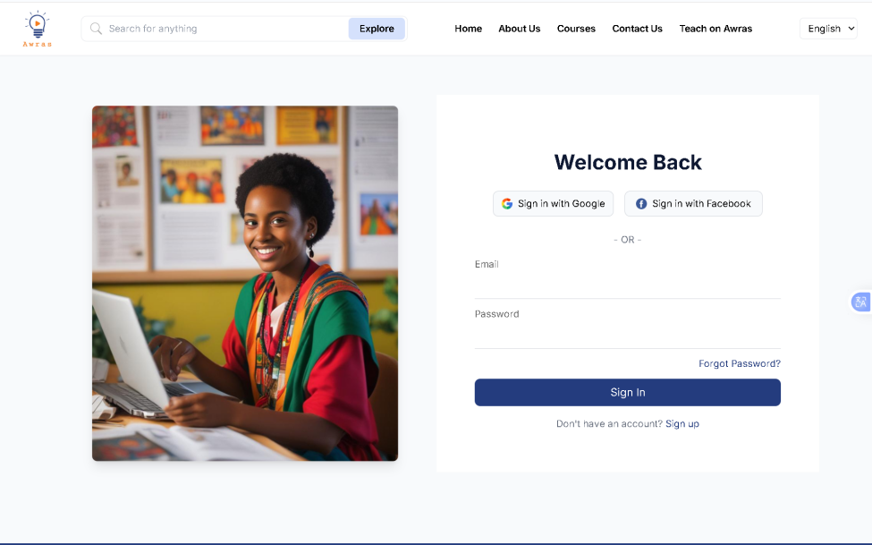

# 🎓 Awras (አውራስ) - Ethiopian E-Learning Marketplace

**Awras** is a localized e-learning platform designed specifically for the Ethiopian community. Inspired by platforms like Udemy, Awras allows experts and educators to create, host, and sell courses, while providing students with affordable, high-quality education in local languages.

---

## 🇪🇹 Why Awras?

Traditional e-learning platforms often ignore the unique needs of the Ethiopian market. **Awras** (meaning "The Lead" or "Top") solves this by providing:

- **Local Language Support:** Courses in Amharic, Afaan Oromo, Tigrinya, and English.
- **Local Payment Integration:** Pay using Telebirr, CBE Birr, Chapa, or SantimPay.
- **Offline Mode:** Downloadable lessons for areas with limited internet connectivity.
- **Low-Bandwidth Optimization:** Video streaming that works on 3G and 4G networks.

---

## ✨ Key Features

### For Students

- **Course Discovery:** Search by category, instructor, or language.
- **Learning Dashboard:** Track your progress across multiple courses.
- **Quizzes & Assignments:** Test your knowledge with interactive content.
- **Certificates:** Receive a digital certificate upon course completion.
- **Direct Chat:** Messaging system to talk to instructors directly.

### For Instructors

- **Course Builder:** Drag-and-drop tools to upload videos, PDFs, and tests.
- **Revenue Analytics:** Real-time dashboard to see earnings and student enrollment.
- **Automatic Payouts:** Withdraw earnings directly to your Ethiopian bank account.
- **Marketing Tools:** Create coupons and promotional codes for your courses.

---

## 🛠️ Tech Stack

<p align="left">
  
  
  
</p>
## 🛠️ Tech Stack

- **Frontend:** [React.js](https://reactjs.org/)
- **Backend:** [Node.js](https://nodejs.org/) & [Express](https://expressjs.com/)
- **Database:** [MYSQL]

---

## ⚙️ Getting Started

### Installation

1. **Clone the repo:**

   ```bash
   git clone https://github.com/your-username/awras-platform.git
   cd awras-platform
   ```

   Install Backend Dependencies:

   ```bash
   cd server
   npm install
   ```

   Install Frontend Dependencies:

   ```bash
    cd ../client
    npm install
   ```

   Environment Setup:
   Create a .env file in the server directory and add your credentials:
   front end
   Env

   ```
   VITE_API_BASE_URL
   VITE_API_GOOGLE_AUTH_URL
   ```

   backend
   Env

   ````
   PORT=5000
   JWT_SECRET=your_jwt_secret
   CHAPA_SECRET_KEY=your_chapa_api_key```

   Run the App:

   ```# From root directory
   npm run dev
   ````
